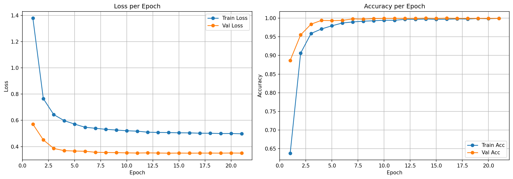
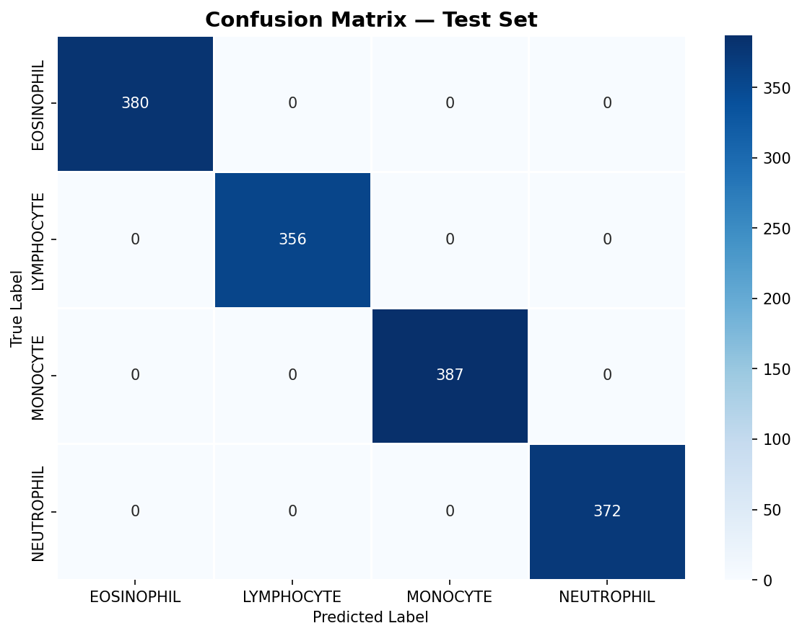
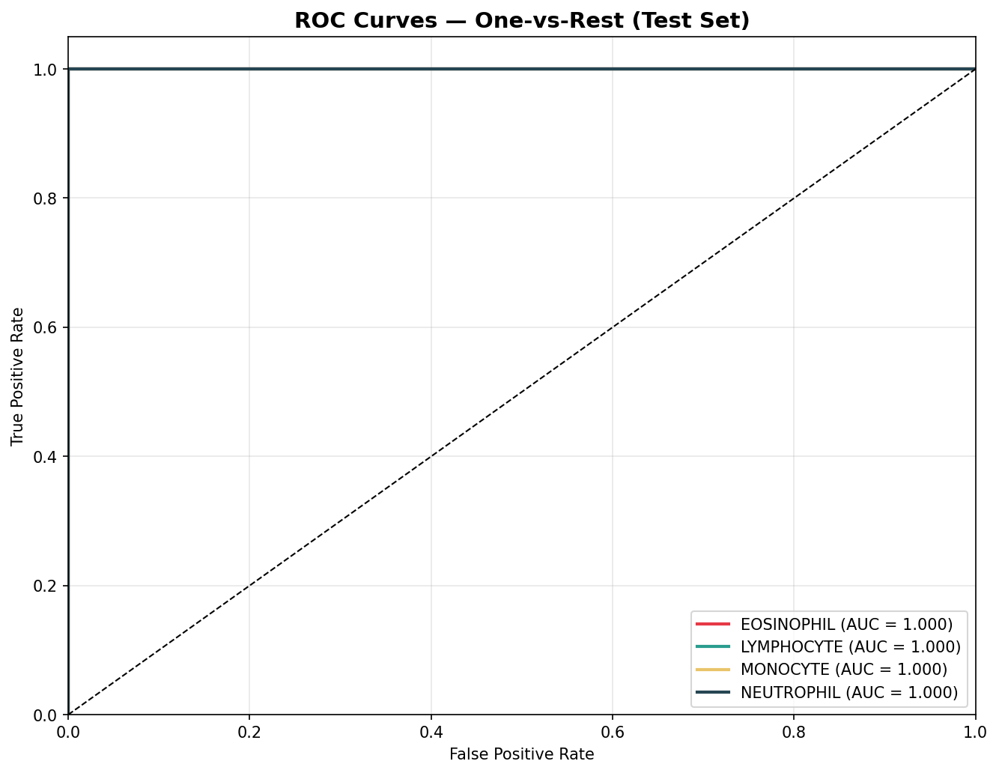

# Blood Cell Classification Using InceptionV3

> B.Tech CSE | Deep Learning Assignment | SoCSE, SMVDU | Semester 6 (2025–26)

---

## Authors

| Name | Entry No. |
|---|---|
| Parag Kumar | 23BCS060 |
| Rohit Yadav | 23BCS077 |
| Rishav Kumar Gupta | 23BCS076 |

---

## Overview

Four-class blood cell image classification using **InceptionV3 full fine-tuning** in PyTorch on the BCCD dataset.

| | |
|---|---|
| **Model** | InceptionV3 (ImageNet pretrained, all layers fine-tuned) |
| **Dataset** | BCCD — 9,957 microscopic blood cell images |
| **Classes** | Eosinophil · Lymphocyte · Monocyte · Neutrophil |
| **Framework** | PyTorch |
| **Platform** | Google Colab (T4 GPU) |
| **Input Size** | 299 × 299 |

---

## Results

| Metric | Value |
|---|---|
| Test Accuracy | **100.00%** |
| Macro F1-Score | **1.00** |
| Macro AUC-ROC | **1.0000** |
| Epochs Trained | 21 |

### Per-Class Metrics

| Class | Precision | Recall | F1 | AUC-ROC |
|---|---|---|---|---|
| Eosinophil | 1.00 | 1.00 | 1.00 | 1.0000 |
| Lymphocyte | 1.00 | 1.00 | 1.00 | 1.0000 |
| Monocyte | 1.00 | 1.00 | 1.00 | 1.0000 |
| Neutrophil | 1.00 | 1.00 | 1.00 | 1.0000 |

### vs Frozen Backbone Baseline

| Metric | Frozen Backbone | Full Fine-Tuning |
|---|---|---|
| Test Accuracy | 61.07% | **100.00%** |
| Macro F1 | 0.61 | **1.00** |
| Macro AUC-ROC | 0.8434 | **1.0000** |

---

## Outputs







---

## Repository Structure

```
├── BCCD_InceptionV3.ipynb        # Colab notebook
├── model_v2.pth                  # Trained model weights (full fine-tuning)
├── outputs/
│   ├── train_val_plot.png
│   ├── confusion_matrix.png
│   └── roc_curves.png
├── paper/
│   ├── main.tex                  # IEEE LaTeX source
│   ├── DeepLearningAssignment.pdf
│   ├── train_val_plot.png
│   ├── confusion_matrix.png
│   └── roc_curves.png
└── README.md
```

---

## How to Run

### 1. Get the dataset
Download from Kaggle: https://www.kaggle.com/datasets/paultimothymooney/blood-cells

### 2. Set up Colab

**Cell 1 — Install:**
```python
!pip install -q torch torchvision tqdm scikit-learn seaborn matplotlib
```

**Cell 2 — Extract dataset:**
```python
import zipfile, shutil, os

with zipfile.ZipFile("/content/archive.zip", "r") as z:
    z.extractall("/content/raw")

shutil.copytree(
    "/content/raw/dataset2-master/dataset2-master/images/TRAIN",
    "/content/data"
)
print(os.listdir("/content/data"))
```

**Cell 3 — Run the training script**

Runtime: ~2.5 hours on T4 GPU (21 epochs with early stopping).

---

## Model Details

| Component | Detail |
|---|---|
| Backbone | InceptionV3 (all 24,354,536 params trainable) |
| Output layer | `Linear(2048, 4)` |
| Aux layer | `Linear(768, 4)` |
| Loss | Cross-entropy + label smoothing (ε=0.1) + 0.4× aux loss |
| Optimizer | Adam, lr=1e-5, weight decay=1e-4 |
| Scheduler | CosineAnnealingLR (η_min=1e-7) |
| Gradient clipping | max norm = 1.0 |
| Early stopping | patience = 7 on val accuracy |

---

*April 2026 | B.Tech CSE 6th Semester | SoCSE, SMVDU*
